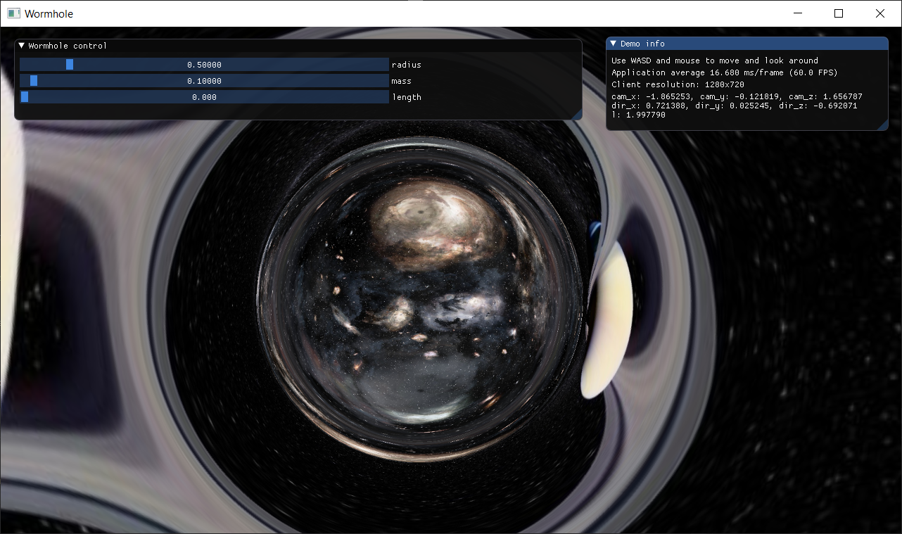

# Wormhole Raytracer DX12
Implementation of paper [Visualizing Interstellar's Wormhole](https://arxiv.org/pdf/1502.03809.pdf)\
And it runs in realtime, you can interactively adjust wormhole's parameters to see the effect

# Images

